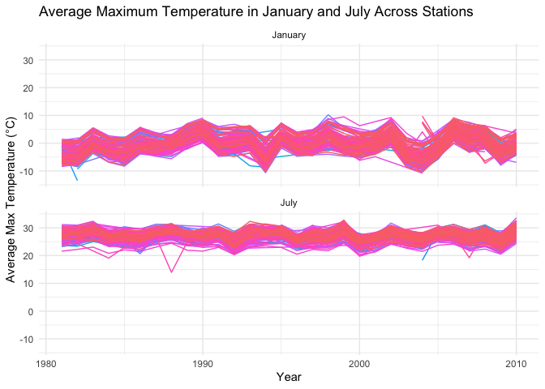
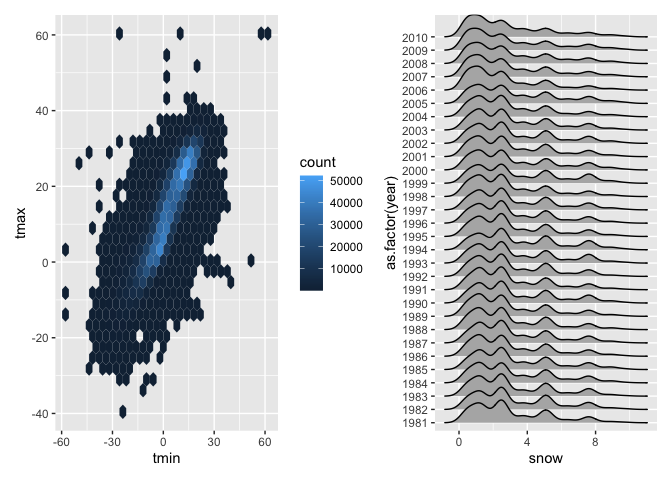
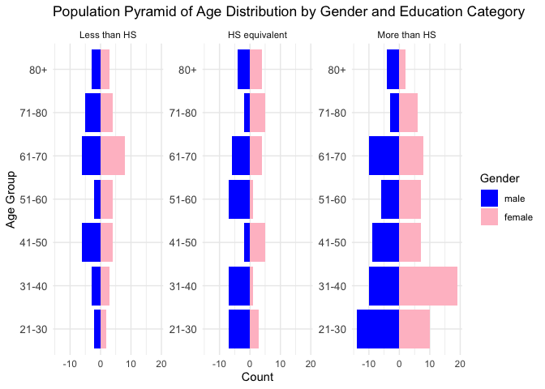

p8105_hw3_iah2124
================
Iris Hart
2024-10-10

# Problem 1

### Loading packages + data

``` r
library(tidyverse)
```

    ## ── Attaching core tidyverse packages ──────────────────────── tidyverse 2.0.0 ──
    ## ✔ dplyr     1.1.4     ✔ readr     2.1.5
    ## ✔ forcats   1.0.0     ✔ stringr   1.5.1
    ## ✔ ggplot2   3.5.1     ✔ tibble    3.2.1
    ## ✔ lubridate 1.9.3     ✔ tidyr     1.3.1
    ## ✔ purrr     1.0.2     
    ## ── Conflicts ────────────────────────────────────────── tidyverse_conflicts() ──
    ## ✖ dplyr::filter() masks stats::filter()
    ## ✖ dplyr::lag()    masks stats::lag()
    ## ℹ Use the conflicted package (<http://conflicted.r-lib.org/>) to force all conflicts to become errors

``` r
library(ggplot2)
library(readr)
library(ggridges)
library(patchwork)


library(p8105.datasets)
data("ny_noaa")
```

There are 7 variables and 2,595,176 observations in the NY NOAA data
set. The variables are Weather station ID, observation date,
precipitation (tenths of mm), snowfall (mm), snow depth (mm),
temperature max and temperature min (in tenths of degrees C).

Create year, month, and day variables and convert precipitation variable
to be mm instead of tenths of mm. Convert daily temperature min and max
variables to be degrees to be degrees Celsius from tenths of degrees
Celsius.

``` r
library(dplyr)
library(lubridate)

ny_noaa_clean <- ny_noaa %>%
  mutate(
    year = year(date),              
    month = month(date),            
    day = day(date),               
    tmax = as.numeric(tmax) / 10,   
    tmin = as.numeric(tmin) / 10,   
    prcp = as.numeric(prcp) / 100,  
    snow = as.numeric(snow) / 10    
  )
```

View to make sure new variables are created and changes were made

``` r
view(ny_noaa_clean)
```

### Snowfall analysis: most commonly observed values

``` r
snowfall_counts = ny_noaa_clean %>%
  count(snow) %>%
  arrange(desc(n))  

head(snowfall_counts)
```

    ## # A tibble: 6 × 2
    ##    snow       n
    ##   <dbl>   <int>
    ## 1   0   2008508
    ## 2  NA    381221
    ## 3   2.5   31022
    ## 4   1.3   23095
    ## 5   5.1   18274
    ## 6   7.6   10173

The most commonly observed day by far was 0cm, for 2,008,508 times. This
makes sense because most days in NY do not have snow, there are only a
few days a year that it does snow. The next most common observation was
NA (n = 381,221), which also makes sense since missing data is common.
The next most common snowfall amounts were 2.5cm(n = 31,022) and 1.3cm(n
= 23,095). These amounts are pretty small but it doesn’t typically snow
too much when it does snow so this also would be common amounts. The
last two most common snowfall amounts are 5.1cm(n = 18,274) and 7.6cm(n
= 10,173). These amounts are a bit larger than the last two but still
not a huge amount of snow.

### Create a two-panel plot of average max temperature in Jan and July

``` r
ny_noaa_clean = 
  ny_noaa_clean %>% 
  separate(date, into = c("year", "month", "day"), convert = TRUE) %>% 
  mutate(
    tmax = as.numeric(tmax),
    tmin = as.numeric(tmin))
```

``` r
ny_noaa_clean %>% 
  group_by(id, year, month) %>% 
  filter(month %in% c(1, 7)) %>% 
  summarize(mean_tmax = mean(tmax, na.rm = TRUE, color = id)) %>% 
  ggplot(aes(x = year, y = mean_tmax, group = id)) + geom_point() + geom_path() +
  facet_grid(~month) +
  labs(title = "Mean monthly temperature for each station across years for January and July")
```

    ## `summarise()` has grouped output by 'id', 'year'. You can override using the
    ## `.groups` argument.

    ## Warning: Removed 5970 rows containing missing values or values outside the scale range
    ## (`geom_point()`).

    ## Warning: Removed 5931 rows containing missing values or values outside the scale range
    ## (`geom_path()`).

<!-- -->

Depicted above is a two-panel plot of the average max temperature in
January and July in each station across years. The mean temperature in
January is a lot lower than the mean temperature in July. This is true
across all stations in all years. The stations follow a similar pattern
of temperature highs and lows during the month for all years. We do see
a few outliers such as a colder day in july around 1987, and a few
others.

# Create a plot showing the distribution of snowfall

``` r
hex = 
  ny_noaa_clean %>% 
  ggplot(aes(x = tmin, y = tmax)) + 
  geom_hex()

ridge = 
  ny_noaa_clean %>% 
  filter(snow < 10, snow > 0) %>%
  ggplot(aes(x = snow, y = as.factor(year))) + 
  geom_density_ridges()

hex + ridge
```

    ## Warning: Removed 1136276 rows containing non-finite outside the scale range
    ## (`stat_binhex()`).

    ## Picking joint bandwidth of 0.376

<!-- -->
Above is a two-panel plot with a hex plot of the ‘tmx’ vs ‘tmin’ for the
full data set, and a ridge plot showing the distribution of snowfall
values in mm, greater than 0 and less than 10. This is separated by
year.

In the hex plot, the majority of the data is clustered in the center of
the distribution. In some rare cases, the ‘tmax’ appears less than the
‘tmin’, which could bring into question the quality and recording of
data.

In the ride plot, each year has a multimodal snowfall density. Most
stations are seeing between 0 and 3.5 cm of snow in a year. Another
group is seeing closer to 4.5cm of snow, and the final group is seeing
about 7.8-8cm of snow. It is likely this multimodality stems from
measurement conversions, which was also noted in the table of common
values.

# Problem 2

### Part 1: Load and clean the datasets

``` r
accelerometer_data = read_csv("nhanes_accel.csv")
```

    ## Rows: 250 Columns: 1441
    ## ── Column specification ────────────────────────────────────────────────────────
    ## Delimiter: ","
    ## dbl (1441): SEQN, min1, min2, min3, min4, min5, min6, min7, min8, min9, min1...
    ## 
    ## ℹ Use `spec()` to retrieve the full column specification for this data.
    ## ℹ Specify the column types or set `show_col_types = FALSE` to quiet this message.

``` r
demographic_data = read_csv("nhanes_covar.csv")
```

    ## New names:
    ## Rows: 254 Columns: 5
    ## ── Column specification
    ## ──────────────────────────────────────────────────────── Delimiter: "," chr
    ## (5): ...1, 1 = male, ...3, ...4, 1 = Less than high school
    ## ℹ Use `spec()` to retrieve the full column specification for this data. ℹ
    ## Specify the column types or set `show_col_types = FALSE` to quiet this message.
    ## • `` -> `...1`
    ## • `` -> `...3`
    ## • `` -> `...4`

View the data

``` r
view(demographic_data)
view(accelerometer_data)
```

Checking column names in order to rename variables

``` r
colnames(demographic_data)
```

    ## [1] "...1"                      "1 = male"                 
    ## [3] "...3"                      "...4"                     
    ## [5] "1 = Less than high school"

Renaming variables

``` r
demographic_data = demographic_data %>%
    rename(
        SEQN = `...1`,  
        sex = `1 = male`,  
        age = `...3`,  
        BMI = `...4`,  
        education = `1 = Less than high school`  
    ) %>%
    mutate(
        sex = as.numeric(sex), 
        age = as.numeric(age),  
        BMI = as.numeric(BMI),
        education = as.numeric(education)  
    )
```

    ## Warning: There were 4 warnings in `mutate()`.
    ## The first warning was:
    ## ℹ In argument: `sex = as.numeric(sex)`.
    ## Caused by warning:
    ## ! NAs introduced by coercion
    ## ℹ Run `dplyr::last_dplyr_warnings()` to see the 3 remaining warnings.

Viewing changes to variables

``` r
view(demographic_data)
```

Deleting the first three rows of empty data

``` r
demographic_data = demographic_data[-c(1:4), ]
```

Removing those less than 21 years of age

``` r
demographic_data = demographic_data %>%
    filter(age >= 21)
```

Remove those with missing data

``` r
demographic_data = demographic_data %>%
    drop_na()
```

Viewing changes to variables

``` r
view(demographic_data)
```

Cleaning acceleratorometer data

``` r
accelerometer_data = na.omit(accelerometer_data)
```

``` r
remaining_seqns = unique(demographic_data$SEQN)
```

``` r
accelerometer_data = accelerometer_data %>%
    mutate(SEQN = as.character(SEQN))
```

``` r
merged_data = demographic_data %>%
    left_join(accelerometer_data, by = "SEQN")
```

``` r
view(merged_data)
```

Encoding data with reasonable variable classes

``` r
library(dplyr)

new_merged_data = merged_data %>%
    mutate(
        sex = as.numeric(sex), 
        age = as.numeric(age),  
        BMI = as.numeric(BMI),  
        education = as.numeric(education),  
        
        age = cut(age, 
                  breaks = c(20, 30, 40, 50, 60, 70, 80, Inf), 
                  labels = c("21-30", "31-40", "41-50", "51-60", "61-70", "71-80", "80+"),
                  right = FALSE),
                  
        BMI = cut(BMI, 
                           breaks = c(0, 18.5, 24.9, 29.9, 34.9, Inf), 
                           labels = c("Underweight", "Normal weight", "Overweight", "Obesity I", "Obesity II"), 
                           right = TRUE)
    ) %>%
    mutate(
        sex = factor(sex, levels = c(1, 2), labels = c("male", "female")),
        education = factor(education, 
                           levels = c(1, 2, 3), 
                           labels = c("Less than HS", "HS equivalent", "More than HS")),
        age = factor(age, ordered = TRUE), 
        BMI = factor(BMI, ordered = TRUE)  
    )
view(new_merged_data)
```

## Part 2

Creating a reader friendly display of education data for men and women

``` r
library(knitr)

education_summary = new_merged_data %>%
    group_by(education) %>%
    summarise(
        men = sum(sex == "male", na.rm = TRUE),
        women = sum(sex == "female", na.rm = TRUE)
    ) %>%
    pivot_longer(cols = c(men, women), names_to = "Gender", values_to = "Count") %>%
    arrange(education)
```

``` r
print(knitr::kable(education_summary, caption = "Number of Men and Women in Each Education Category"))
```

    ## 
    ## 
    ## Table: Number of Men and Women in Each Education Category
    ## 
    ## |education     |Gender | Count|
    ## |:-------------|:------|-----:|
    ## |Less than HS  |men    |    27|
    ## |Less than HS  |women  |    28|
    ## |HS equivalent |men    |    35|
    ## |HS equivalent |women  |    23|
    ## |More than HS  |men    |    56|
    ## |More than HS  |women  |    59|

Creating education by age and gender visualization

``` r
library(dplyr)
library(ggplot2)

# Assuming your existing age groups are in a column named 'age_group'
visualization_education = new_merged_data %>%
    group_by(age, sex, education) %>%
    summarise(count = n(), .groups = "drop") %>%
    mutate(count = ifelse(sex == "male", -count, count))  # Negative count for males

# Create the bar plot
ggplot(visualization_education, aes(x = age, y = count, fill = sex)) +  
    geom_bar(stat = "identity") +
    coord_flip() +  # Flip coordinates for a better population pyramid appearance
    facet_wrap(~ education, scales = "free_y") +  # Separate panels for each education level
    labs(
        title = "Population Pyramid of Age Distribution by Gender and Education Category",
        x = "Age Group",
        y = "Count",
        fill = "Gender"
    ) +
    theme_minimal() +
    scale_fill_manual(values = c("male" = "blue", "female" = "pink")) +  
    theme(axis.text.y = element_text(size = 10))  
```

<!-- -->

Aggregate across minutes to create a total activity variable for each
participant
