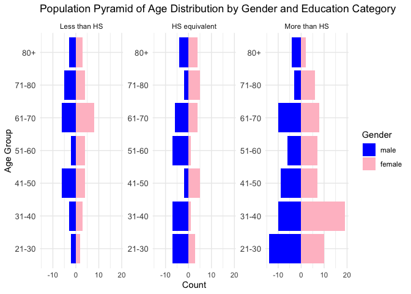
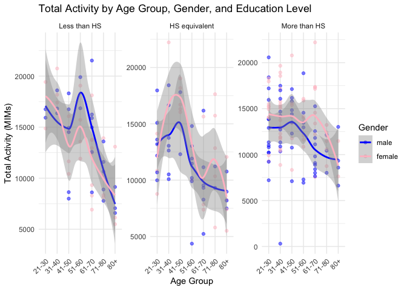
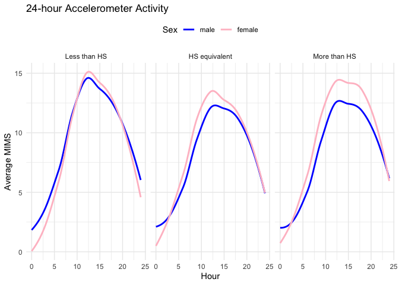
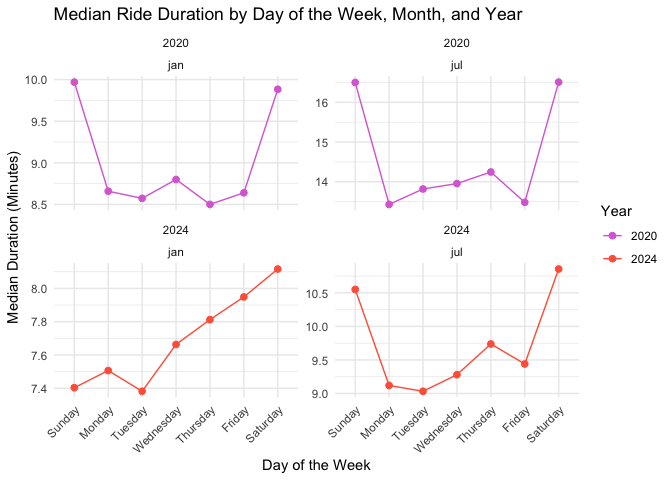
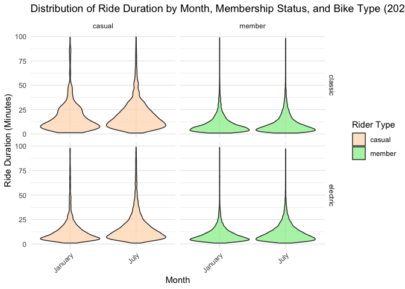

p8105_hw3_iah2124
================
Iris Hart
2024-10-10

# Problem 1

### Loading packages + data

``` r
library(tidyverse)
```

    ## ── Attaching core tidyverse packages ──────────────────────── tidyverse 2.0.0 ──
    ## ✔ dplyr     1.1.4     ✔ readr     2.1.5
    ## ✔ forcats   1.0.0     ✔ stringr   1.5.1
    ## ✔ ggplot2   3.5.1     ✔ tibble    3.2.1
    ## ✔ lubridate 1.9.3     ✔ tidyr     1.3.1
    ## ✔ purrr     1.0.2     
    ## ── Conflicts ────────────────────────────────────────── tidyverse_conflicts() ──
    ## ✖ dplyr::filter() masks stats::filter()
    ## ✖ dplyr::lag()    masks stats::lag()
    ## ℹ Use the conflicted package (<http://conflicted.r-lib.org/>) to force all conflicts to become errors

``` r
library(ggplot2)
library(readr)
library(ggridges)
library(patchwork)
library(rvest)
```

    ## 
    ## Attaching package: 'rvest'
    ## 
    ## The following object is masked from 'package:readr':
    ## 
    ##     guess_encoding

``` r
library(httr)
library(knitr)


library(p8105.datasets)
data("ny_noaa")
```

There are 7 variables and 2,595,176 observations in the NY NOAA data
set. The variables are Weather station ID, observation date,
precipitation (tenths of mm), snowfall (mm), snow depth (mm),
temperature max and temperature min (in tenths of degrees C).

Create year, month, and day variables and convert precipitation variable
to be mm instead of tenths of mm. Convert daily temperature min and max
variables to be degrees to be degrees Celsius from tenths of degrees
Celsius.

``` r
library(dplyr)
library(lubridate)

ny_noaa_clean <- ny_noaa %>%
  mutate(
    year = year(date),              
    month = month(date),            
    day = day(date),               
    tmax = as.numeric(tmax) / 10,   
    tmin = as.numeric(tmin) / 10,   
    prcp = as.numeric(prcp) / 100,  
    snow = as.numeric(snow) / 10    
  )
```

View to make sure new variables are created and changes were made

``` r
view(ny_noaa_clean)
```

### Snowfall analysis: most commonly observed values

``` r
snowfall_counts = ny_noaa_clean %>%
  count(snow) %>%
  arrange(desc(n))  

head(snowfall_counts)
```

    ## # A tibble: 6 × 2
    ##    snow       n
    ##   <dbl>   <int>
    ## 1   0   2008508
    ## 2  NA    381221
    ## 3   2.5   31022
    ## 4   1.3   23095
    ## 5   5.1   18274
    ## 6   7.6   10173

The most commonly observed day by far was 0cm, for 2,008,508 times. This
makes sense because most days in NY do not have snow, there are only a
few days a year that it does snow. The next most common observation was
NA (n = 381,221), which also makes sense since missing data is common.
The next most common snowfall amounts were 2.5cm(n = 31,022) and 1.3cm(n
= 23,095). These amounts are pretty small but it doesn’t typically snow
too much when it does snow so this also would be common amounts. The
last two most common snowfall amounts are 5.1cm(n = 18,274) and 7.6cm(n
= 10,173). These amounts are a bit larger than the last two but still
not a huge amount of snow.

### Create a two-panel plot of average max temperature in Jan and July

``` r
ny_noaa_clean = 
  ny_noaa_clean %>% 
  separate(date, into = c("year", "month", "day"), convert = TRUE) %>% 
  mutate(
    tmax = as.numeric(tmax),
    tmin = as.numeric(tmin))
```

``` r
ny_noaa_clean %>% 
  group_by(id, year, month) %>% 
  filter(month %in% c(1, 7)) %>% 
  summarize(mean_tmax = mean(tmax, na.rm = TRUE, color = id)) %>% 
  ggplot(aes(x = year, y = mean_tmax, group = id)) + geom_point() + geom_path() +
  facet_grid(~month) +
  labs(title = "Mean monthly temperature for each station across years for January and July")
```

    ## `summarise()` has grouped output by 'id', 'year'. You can override using the
    ## `.groups` argument.

    ## Warning: Removed 5970 rows containing missing values or values outside the scale range
    ## (`geom_point()`).

    ## Warning: Removed 5931 rows containing missing values or values outside the scale range
    ## (`geom_path()`).

<!-- -->

Depicted above is a two-panel plot of the average max temperature in
January and July in each station across years. The mean temperature in
January is a lot lower than the mean temperature in July. This is true
across all stations in all years. The stations follow a similar pattern
of temperature highs and lows during the month for all years. We do see
a few outliers such as a colder day in july around 1987, and a few
others.

# Create a plot showing the distribution of snowfall

``` r
hex = 
  ny_noaa_clean %>% 
  ggplot(aes(x = tmin, y = tmax)) + 
  geom_hex()

ridge = 
  ny_noaa_clean %>% 
  filter(snow < 10, snow > 0) %>%
  ggplot(aes(x = snow, y = as.factor(year))) + 
  geom_density_ridges()

hex + ridge
```

    ## Warning: Removed 1136276 rows containing non-finite outside the scale range
    ## (`stat_binhex()`).

    ## Picking joint bandwidth of 0.376

<!-- -->
Above is a two-panel plot with a hex plot of the ‘tmx’ vs ‘tmin’ for the
full data set, and a ridge plot showing the distribution of snowfall
values in mm, greater than 0 and less than 10. This is separated by
year.

In the hex plot, the majority of the data is clustered in the center of
the distribution. In some rare cases, the ‘tmax’ appears less than the
‘tmin’, which could bring into question the quality and recording of
data.

In the ride plot, each year has a multimodal snowfall density. Most
stations are seeing between 0 and 3.5 cm of snow in a year. Another
group is seeing closer to 4.5cm of snow, and the final group is seeing
about 7.8-8cm of snow. It is likely this multimodality stems from
measurement conversions, which was also noted in the table of common
values.

# Problem 2

### Part 1: Load and clean the datasets

``` r
accelerometer_data = read_csv("nhanes_accel.csv")
```

    ## Rows: 250 Columns: 1441
    ## ── Column specification ────────────────────────────────────────────────────────
    ## Delimiter: ","
    ## dbl (1441): SEQN, min1, min2, min3, min4, min5, min6, min7, min8, min9, min1...
    ## 
    ## ℹ Use `spec()` to retrieve the full column specification for this data.
    ## ℹ Specify the column types or set `show_col_types = FALSE` to quiet this message.

``` r
demographic_data = read_csv("nhanes_covar.csv")
```

    ## New names:
    ## Rows: 254 Columns: 5
    ## ── Column specification
    ## ──────────────────────────────────────────────────────── Delimiter: "," chr
    ## (5): ...1, 1 = male, ...3, ...4, 1 = Less than high school
    ## ℹ Use `spec()` to retrieve the full column specification for this data. ℹ
    ## Specify the column types or set `show_col_types = FALSE` to quiet this message.
    ## • `` -> `...1`
    ## • `` -> `...3`
    ## • `` -> `...4`

View the data

``` r
view(demographic_data)
view(accelerometer_data)
```

Checking column names in order to rename variables

``` r
colnames(demographic_data)
```

    ## [1] "...1"                      "1 = male"                 
    ## [3] "...3"                      "...4"                     
    ## [5] "1 = Less than high school"

Renaming variables

``` r
demographic_data = demographic_data %>%
    rename(
        SEQN = `...1`,  
        sex = `1 = male`,  
        age = `...3`,  
        BMI = `...4`,  
        education = `1 = Less than high school`  
    ) %>%
    mutate(
        sex = as.numeric(sex), 
        age = as.numeric(age),  
        BMI = as.numeric(BMI),
        education = as.numeric(education)  
    )
```

    ## Warning: There were 4 warnings in `mutate()`.
    ## The first warning was:
    ## ℹ In argument: `sex = as.numeric(sex)`.
    ## Caused by warning:
    ## ! NAs introduced by coercion
    ## ℹ Run `dplyr::last_dplyr_warnings()` to see the 3 remaining warnings.

Viewing changes to variables

``` r
view(demographic_data)
```

Deleting the first three rows of empty data

``` r
demographic_data = demographic_data[-c(1:4), ]
```

Removing those less than 21 years of age

``` r
demographic_data = demographic_data %>%
    filter(age >= 21)
```

Remove those with missing data

``` r
demographic_data = demographic_data %>%
    drop_na()
```

Viewing changes to variables

``` r
view(demographic_data)
```

Cleaning acceleratorometer data

``` r
accelerometer_data = na.omit(accelerometer_data)
```

``` r
remaining_seqns = unique(demographic_data$SEQN)
```

``` r
accelerometer_data = accelerometer_data %>%
    mutate(SEQN = as.character(SEQN))
```

``` r
merged_data = demographic_data %>%
    left_join(accelerometer_data, by = "SEQN")
```

``` r
view(merged_data)
```

Encoding data with reasonable variable classes

``` r
library(dplyr)

total_merged_data = merged_data %>%
    mutate(
        sex = as.numeric(sex), 
        age = as.numeric(age),  
        BMI = as.numeric(BMI),  
        education = as.numeric(education),  
        
        age = cut(age, 
                  breaks = c(20, 30, 40, 50, 60, 70, 80, Inf), 
                  labels = c("21-30", "31-40", "41-50", "51-60", "61-70", "71-80", "80+"),
                  right = FALSE),
                  
        BMI = cut(BMI, 
                           breaks = c(0, 18.5, 24.9, 29.9, 34.9, Inf), 
                           labels = c("Underweight", "Normal weight", "Overweight", "Obesity I", "Obesity II"), 
                           right = TRUE)
    ) %>%
    mutate(
        sex = factor(sex, levels = c(1, 2), labels = c("male", "female")),
        education = factor(education, 
                           levels = c(1, 2, 3), 
                           labels = c("Less than HS", "HS equivalent", "More than HS")),
        age = factor(age, ordered = TRUE), 
        BMI = factor(BMI, ordered = TRUE)  
    )
view(total_merged_data)
```

## Part 2

Creating a reader friendly display of education data for men and women

``` r
eduction_table = total_merged_data |> 
  count(education, sex) |> 
  pivot_wider(names_from = sex, values_from = n, values_fill = 0) |> 
  rename("Education Level"= education)

kable(eduction_table, format = "markdown", caption = "Number of Men and Women in Each Education Category")
```

| Education Level | male | female |
|:----------------|-----:|-------:|
| Less than HS    |   27 |     28 |
| HS equivalent   |   35 |     23 |
| More than HS    |   56 |     59 |

Number of Men and Women in Each Education Category

There was one more female (n = 28) than male (n = 27) in the less than
high school education category. There were 12 more men (n = 35) than
women (n = 23) in the equal to high school category. In the more than
high school category, there were 3 more women (n = 59) than men (n =
56). There were overall more men in this data set than women.

Creating education by age and gender visualization

``` r
library(dplyr)
library(ggplot2)

visualization_education = total_merged_data %>%
    group_by(age, sex, education) %>%
    summarise(count = n(), .groups = "drop") %>%
    mutate(count = ifelse(sex == "male", -count, count))  

ggplot(visualization_education, aes(x = age, y = count, fill = sex)) +  
    geom_bar(stat = "identity") +
    coord_flip() +  
    facet_wrap(~ education, scales = "free_y") +  
    labs(
        title = "Population Pyramid of Age Distribution by Gender and Education Category",
        x = "Age Group",
        y = "Count",
        fill = "Gender"
    ) +
    theme_minimal() +
    scale_fill_manual(values = c("male" = "blue", "female" = "pink")) +  
    theme(axis.text.y = element_text(size = 10))  
```

<!-- -->
In this plot, it is surprising that the most amount of people who have
more than a high school degree are in a younger category. I would have
though that the older age groups would have more people (men and women)
in the more than HS group. The less than hs population pyramid appears
to be pretty even with the age groups 41-50 and 61-70 popping out a tad
more for both males and then both genders, respectively. The hs
equivalent population pyramid appears to be pretty even with the age
groups 41-50 and 51-60 having more females and males respectively for
each. The more than high school group is pyramid shaped as the younger
age groups have more people than the older age groups.

Aggregate across minutes to create a total activity variable for each
participant

``` r
total_activity = total_merged_data %>%
  mutate(total_activity = rowSums(select(., -c(1:5)), na.rm = TRUE))

view(total_activity)
```

Creating a plot with trend lines for total activity

``` r
ggplot(total_activity, aes(x = age, y = total_activity, color = sex)) +
  geom_point(alpha = 0.5) +  
  geom_smooth(method = "loess", se = TRUE, aes(group = sex)) +  
  facet_wrap(~ education, scales = "free_y") +  
  labs(
    title = "Total Activity by Age Group, Gender, and Education Level",
    x = "Age Group",
    y = "Total Activity (MIMs)",
    color = "Gender"
  ) +
  theme_minimal() +
  scale_color_manual(values = c("male" = "blue", "female" = "pink")) +  
  theme(axis.text.x = element_text(angle = 45, hjust = 1)) 
```

    ## `geom_smooth()` using formula = 'y ~ x'

<!-- -->

In this visualization, the more than high school education group appears
to have the highest average total activity, with women averaging
slightly higher than men for all age groups except 80+. The less than
high school group starts out with younger women averaging higher than
men and this switches around 45 years with men averaging higher. It
switches back at about 80 years. The high school equivalent group has
women averaging much higher than men for most of the graph besides the
ery start and the very end.

Making a three-panel plot that shows the 24-hour activity time courses
for each education level and use color to indicate sex.

``` r
day_activity = total_merged_data |> 
    pivot_longer(
    cols = min1:min1440,
    names_to = "minute",
    values_to = "mims",
    names_prefix = "min"
  )

view(day_activity)
```

``` r
day_activity |> 
  mutate(
    minute = as.numeric(minute),
    hour = (minute - 1) / 60
  ) |> 
  group_by(SEQN, hour, sex, education) |> 
  summarize(avg_mims = sum(mims, na.rm = TRUE), .groups = "drop") |>  

  ggplot(aes(x = hour, y = avg_mims, color = sex)) +
  geom_smooth(se = FALSE, method = "loess") +  
  facet_grid(. ~ education) +
  labs(
    title = "24-hour Accelerometer Activity",
    x = "Hour",
    y = "Average MIMS",
    color = "Sex"
  ) +
  theme_minimal() +
  scale_color_manual(values = c("male" = "blue", "female" = "pink")) + 
  theme(legend.position = "top")
```

    ## `geom_smooth()` using formula = 'y ~ x'

<!-- -->

# Problem 3

Reading and Cleaning January 2020 Citibike data

``` r
jan2020citi =
  read_csv("citibike/Jan 2020 Citi.csv") |> 
  janitor::clean_names() |> 
  rename(
    ride_type = rideable_type,
    start_station = start_station_name,
    end_station = end_station_name
  ) |> 
  mutate(
    ride_type = str_replace(ride_type, "classic_bike", "classic"),
    ride_type = str_replace(ride_type, "electric_bike", "electric"),
    month = "jan2020"
  )
```

    ## Rows: 12420 Columns: 7
    ## ── Column specification ────────────────────────────────────────────────────────
    ## Delimiter: ","
    ## chr (6): ride_id, rideable_type, weekdays, start_station_name, end_station_n...
    ## dbl (1): duration
    ## 
    ## ℹ Use `spec()` to retrieve the full column specification for this data.
    ## ℹ Specify the column types or set `show_col_types = FALSE` to quiet this message.

``` r
view(jan2020citi)
names(jan2020citi)
```

    ## [1] "ride_id"       "ride_type"     "weekdays"      "duration"     
    ## [5] "start_station" "end_station"   "member_casual" "month"

Reading and Cleaning July 2020 Citibike data

``` r
july2020citi =
  read_csv("citibike/July 2020 Citi.csv") |> 
  janitor::clean_names() |> 
  rename(
    ride_type = rideable_type,
    start_station = start_station_name,
    end_station = end_station_name
  ) |> 
  mutate(
    ride_type = str_replace(ride_type, "classic_bike", "classic"),
    ride_type = str_replace(ride_type, "electric_bike", "electric"),
    month = "july2020"
  )
```

    ## Rows: 21048 Columns: 7
    ## ── Column specification ────────────────────────────────────────────────────────
    ## Delimiter: ","
    ## chr (6): ride_id, rideable_type, weekdays, start_station_name, end_station_n...
    ## dbl (1): duration
    ## 
    ## ℹ Use `spec()` to retrieve the full column specification for this data.
    ## ℹ Specify the column types or set `show_col_types = FALSE` to quiet this message.

``` r
view(july2020citi)
names(july2020citi)
```

    ## [1] "ride_id"       "ride_type"     "weekdays"      "duration"     
    ## [5] "start_station" "end_station"   "member_casual" "month"

Reading and Cleaning January 2024 Citibike data

``` r
jan2024citi =
  read_csv("citibike/Jan 2024 Citi.csv") |> 
  janitor::clean_names() |> 
  rename(
    ride_type = rideable_type,
    start_station = start_station_name,
    end_station = end_station_name
  ) |> 
  mutate(
    ride_type = str_replace(ride_type, "classic_bike", "classic"),
    ride_type = str_replace(ride_type, "electric_bike", "electric"),
    month = "jan2024"
  )
```

    ## Rows: 18861 Columns: 7
    ## ── Column specification ────────────────────────────────────────────────────────
    ## Delimiter: ","
    ## chr (6): ride_id, rideable_type, weekdays, start_station_name, end_station_n...
    ## dbl (1): duration
    ## 
    ## ℹ Use `spec()` to retrieve the full column specification for this data.
    ## ℹ Specify the column types or set `show_col_types = FALSE` to quiet this message.

``` r
view(jan2024citi)
names(jan2024citi)
```

    ## [1] "ride_id"       "ride_type"     "weekdays"      "duration"     
    ## [5] "start_station" "end_station"   "member_casual" "month"

Reading and Cleaning July 2024 Citibike data

``` r
july2024citi =
  read_csv("citibike/July 2024 Citi.csv") |> 
  janitor::clean_names() |> 
  rename(
    ride_type = rideable_type,
    start_station = start_station_name,
    end_station = end_station_name
  ) |> 
  mutate(
    ride_type = str_replace(ride_type, "classic_bike", "classic"),
    ride_type = str_replace(ride_type, "electric_bike", "electric"),
    month = "july2024"
  )
```

    ## Rows: 47156 Columns: 7
    ## ── Column specification ────────────────────────────────────────────────────────
    ## Delimiter: ","
    ## chr (6): ride_id, rideable_type, weekdays, start_station_name, end_station_n...
    ## dbl (1): duration
    ## 
    ## ℹ Use `spec()` to retrieve the full column specification for this data.
    ## ℹ Specify the column types or set `show_col_types = FALSE` to quiet this message.

``` r
view(july2024citi)
names(july2024citi)
```

    ## [1] "ride_id"       "ride_type"     "weekdays"      "duration"     
    ## [5] "start_station" "end_station"   "member_casual" "month"

Combining the 4 separate data sets

``` r
citibike_df <- bind_rows(jan2020citi, july2020citi, jan2024citi, july2024citi)

view(citibike_df)
names(citibike_df)
```

    ## [1] "ride_id"       "ride_type"     "weekdays"      "duration"     
    ## [5] "start_station" "end_station"   "member_casual" "month"

This is a data set that contains information on citibikes in NYC. There
are 99,485 observations and 8 variables. The 8 variables are ride ID,
ride type (classic or electric bike), weekdays (day of the week),
duration (time in minutes of ride), start station, end station, user
type (member or casual), and month (jan2020, july2020, jan2024,
july2024).

Produce a reader-friendly table showing the total number of rides in
each combination of year and month separating casual riders and Citi
Bike members

``` r
total_citirides <- citibike_df |> 
  group_by(month, member_casual) |> 
  summarise(total_rides = n(), .groups = 'drop') |> 
  arrange(month, member_casual)

kable(total_citirides,  
      caption = "Total Number of Rides by Month and Rider Type",
      col.names = c("Month", "Rider Type", "Total Rides"),
      align = "c")
```

|  Month   | Rider Type | Total Rides |
|:--------:|:----------:|:-----------:|
| jan2020  |   casual   |     984     |
| jan2020  |   member   |    11436    |
| jan2024  |   casual   |    2108     |
| jan2024  |   member   |    16753    |
| july2020 |   casual   |    5637     |
| july2020 |   member   |    15411    |
| july2024 |   casual   |    10894    |
| july2024 |   member   |    36262    |

Total Number of Rides by Month and Rider Type

This data table shows the total rides each month including rider type in
which the primary users of citi bike during these times. There were more
rides in July 2024 compared to July 2020. There were more rides in Jan
2024 than than 2020. There are overall more users in July for both years
when compared to both years in Jan. Members use the bike service more
than the casual rider in every month/year.

Making a table showing the 5 most popular starting stations for July
2024

``` r
top_stations <- citibike_df |> 
  filter(month == "july2024") |> 
  group_by(start_station) |> 
  summarise(total_citirides = n(), .groups = 'drop') |> 
  arrange(desc(total_citirides)) |> 
  slice_head(n = 5)

kable(top_stations, 
      caption = "Top 5 Most Popular Starting Stations in July 2024",
      col.names = c("Starting Station", "Number of Rides"),
      align = "c")
```

|     Starting Station     | Number of Rides |
|:------------------------:|:---------------:|
| Pier 61 at Chelsea Piers |       163       |
| University Pl & E 14 St  |       155       |
|     W 21 St & 6 Ave      |       152       |
|  West St & Chambers St   |       150       |
|     W 31 St & 7 Ave      |       146       |

Top 5 Most Popular Starting Stations in July 2024

The five most popular starting stations in July 2024 were Pier 61 at
Chelsea Piers, University PL & E 14 st, W 21 St & 6 Ave, West St &
Chambers St, and W 31 St & 7 Ave.

Making a plot to investigate the effects of day of the week, month, and
year on median ride duration

``` r
timesummaryciti_df <- citibike_df |> 
  mutate(year = str_sub(month, -4),
         month = str_sub(month, 1, 3),
         weekdays = factor(weekdays, 
                            levels = c("Sunday", "Monday", "Tuesday", "Wednesday", 
                                       "Thursday", "Friday", "Saturday"))) |> 
  group_by(year, month, weekdays) |> 
  summarise(median_duration = median(duration), .groups = 'drop')

ggplot(timesummaryciti_df, aes(x = weekdays, y = median_duration, group = year, color = year)) +
  geom_line() +
  geom_point(size = 2) +
  facet_wrap(~ year + month, scales = "free_y") +  
  labs(
    title = "Median Ride Duration by Day of the Week, Month, and Year",
    x = "Day of the Week",
    y = "Median Duration (Minutes)",
    color = "Year"
  ) +
  scale_color_manual(values = c("2020" = "orchid", "2024" = "tomato")) +  
  theme_minimal() +
  theme(axis.text.x = element_text(angle = 45, hjust = 1)) 
```

<!-- -->

2024 figure that shows the impact of month, membership status, and bike
type on the distribution of ride duration

``` r
rides_2024 <- citibike_df |> 
  filter(str_sub(month, -4) == "2024", duration <= 100)

ggplot(rides_2024, aes(x = month, y = duration, fill = member_casual)) +
  geom_violin(trim = TRUE, scale = "width", alpha = 0.7) +
  facet_grid(ride_type ~ member_casual, scales = "free_y") +
  labs(
    title = "Distribution of Ride Duration by Month, Membership Status, and Bike Type (2024)",
    x = "Month",
    y = "Ride Duration (Minutes)",
    fill = "Rider Type"
  ) +
  scale_x_discrete(labels = c("jan2024" = "January", "july2024" = "July")) +
  scale_fill_manual(values = c("member" = "lightgreen", "casual" = "peachpuff1")) +  # Custom fill colors for rider type
  theme_minimal() +
  theme(axis.text.x = element_text(angle = 45, hjust = 1))  
```

<!-- -->
